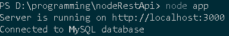
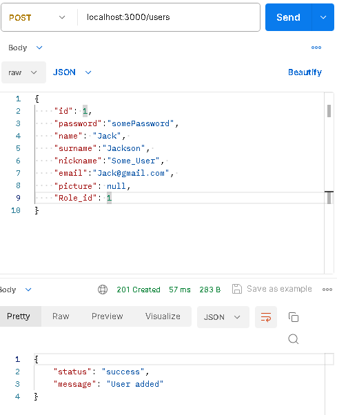
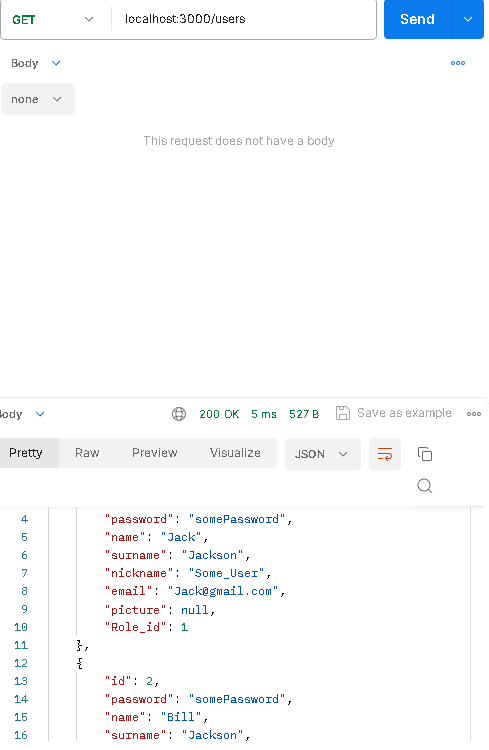
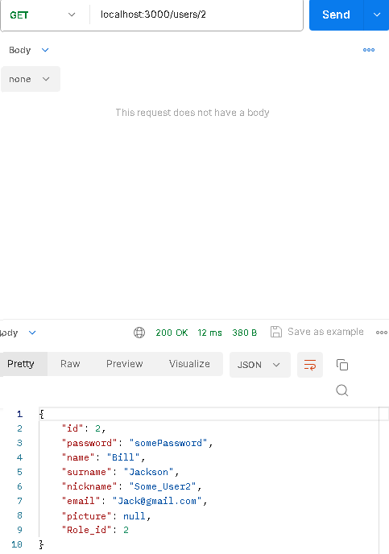
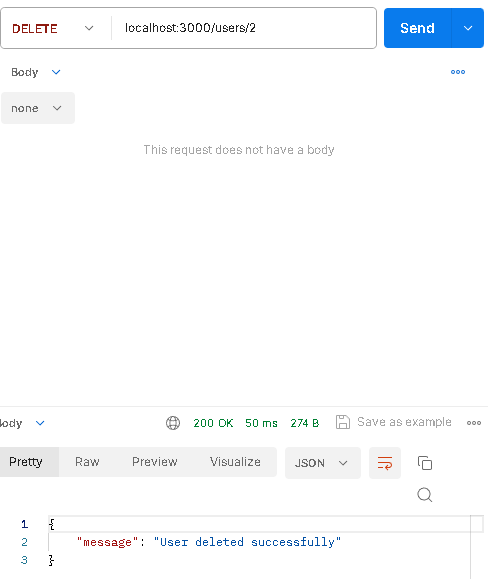
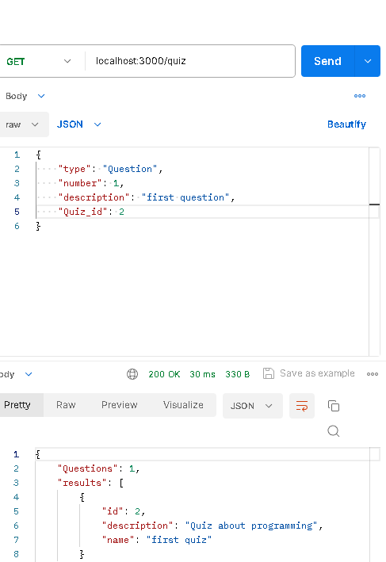
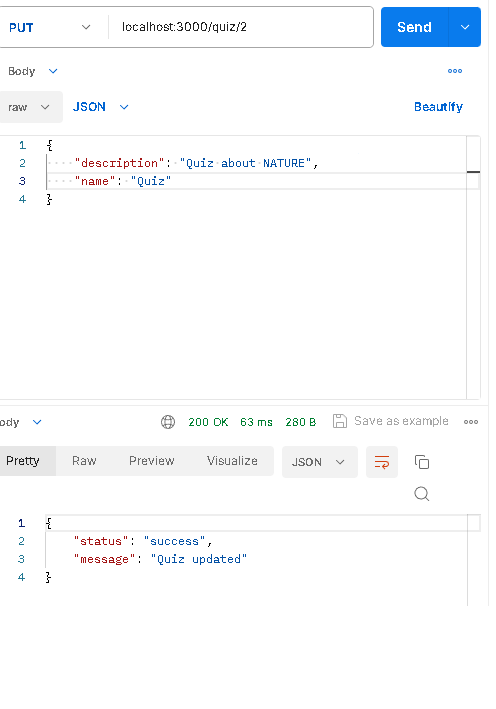
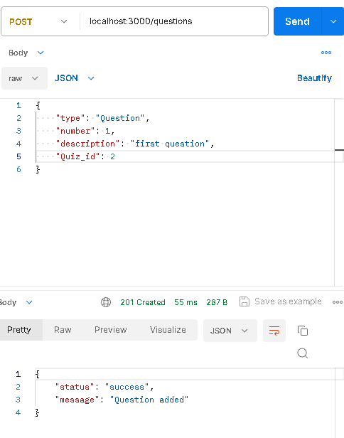
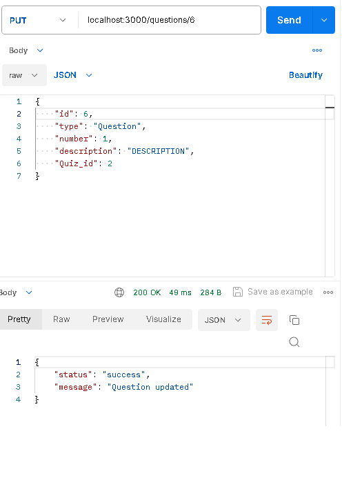

# Тестування працездатності системи

### Сервер:

## Реалізація CRUD:

### POST /users:

### GET /users:

### PUT /users:

### GET /users/:id

### DELETE /users/:id

### POST /quiz:

### GET /quiz:

### PUT /quiz:

### DELETE /quiz/:id

### POST /questions:

### PUT /questions:

### DELETE /questions/:id

